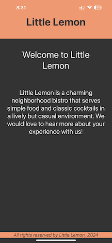
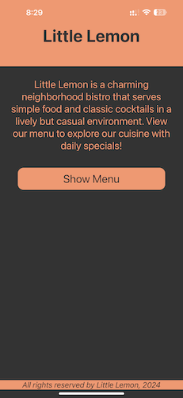
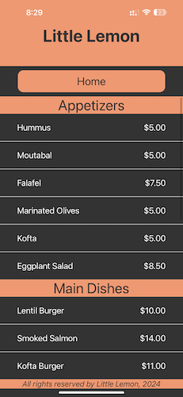
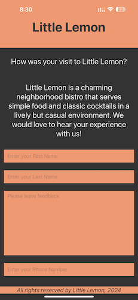
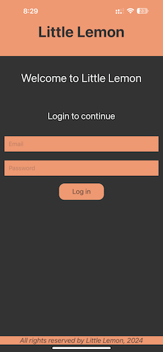
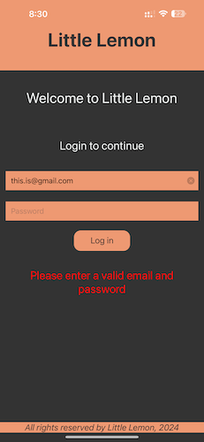
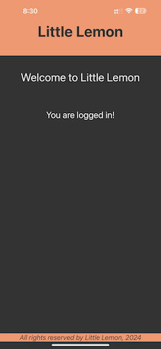

# Little Lemon Restuarant App

Open the `App.js` file to start writing some code. You can preview the changes directly on your phone or tablet by scanning the **QR code** or use the iOS or Android emulators. When you're done, click **Save** and share the link!

When you're ready to see everything that Expo provides (or if you want to use your own editor) you can **Download** your project and use it with [expo-cli](https://docs.expo.io/get-started/installation).

All projects created in Snack are publicly available, so you can easily share the link to this project via link, or embed it on a web page with the `<>` button.

Snack is Open Source. You can find the code on the [GitHub repo](https://github.com/expo/snack).

## Features

The application currently is in development and different features are made available separately.

### Welcome Screen

- `WelcomeScreen.js` supports the welcome screen for introducing the Little Lemon Restuarant

     

### Menu Screen

- `MenuItems.js` the landing page displays a welcoming message and a button to view the menu.

     

- Once the user presses on `Show Menu` button, the app provies the menu items available with their pricing and sectioned views for _Appetizers_, _Main Course_ and _Desserts_

     

### Feedback Screen

- `FeedbackForm.js` gives the users the capability to provide a feedback
  

     

### Login Screen
- `LoginScreen.js` provides the users the capability to login using email and password
- The password is secured input type
- The email has the keyboard type as `email-address` providing enhanced user experience

     

- If the user tries to login without entering an email address or password, the app shows appropriate error

     

- On successful login, the app proceeds and displays a success message

     

## Todo List

- [ ] add various features as options using navigation bar in the application
- [x] ~~*create a login page for the restuarant*~~ [2024-04-06]
- [ ] connect to menu database to fetch the menu items
- [ ] connect to feedback database to persist the feedback
