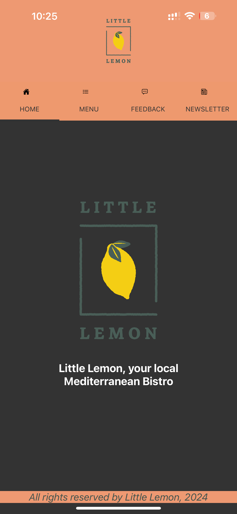

# Little Lemon Restuarant App

Open the `App.js` file to start writing some code. You can preview the changes directly on your phone or tablet by scanning the **QR code** or use the iOS or Android emulators. When you're done, click **Save** and share the link!

When you're ready to see everything that Expo provides (or if you want to use your own editor) you can **Download** your project and use it with [expo-cli](https://docs.expo.io/get-started/installation).

All projects created in Snack are publicly available, so you can easily share the link to this project via link, or embed it on a web page with the `<>` button.

Snack is Open Source. You can find the code on the [GitHub repo](https://github.com/expo/snack).

## Features

The application currently is in development and different features are made available separately.

### Login Screen
- `LoginScreen.js` provides the users the capability to login using email and password
- The password is secured input type
- The email has the keyboard type as `email-address` providing enhanced user experience

     

- The validations on email include: 
  - Can start with a quoted string (e.g., "username") or an unquoted string (e.g., username)
  - The unquoted string can contain letters, digits, and certain special characters (., _, +, -, and @)
  - The email address must contain the @ symbol, followed by either:
    - An IP address in square brackets (e.g., [123.45.67.89])
    - A domain name consisting of one or more parts separated by periods (e.g., example.com)
- The validations on password include:
  - Must be at least 8 characters long
  - Must contain at least one digit
  - Must contain at least one lowercase letter
  - Must contain at least one uppercase letter
  - Must contain at least one special character from the set `!@#$%^&*()_+}{":;'?/>.<,.`
  - Must not contain any whitespace characters (spaces, tabs, newlines, etc.)

     

- On successfully passing the validations, the log in button is clickable

     

### Welcome Screen

- `Home` screen is the landing page after successful login. It introduces the Little Lemon Restuarant

     

### Menu Screen

- Once the user presses on `Menu` tab, the app provies the menu items available with their pricing and sectioned views for _Appetizers_, _Main Course_ and _Desserts_

     

### Feedback Screen

- `FeedbackForm` tab gives the users the capability to provide a feedback
  

     

### Newsletter Screen

- `Newsletter` tab provides the user option to subscribe to the newsletter for updates about the delicious recipes.
  

     

## Todo List

- [x] ~~*add logo to the screens*~~ [2024-04-06]
- [x] ~~*create a login page for the restuarant*~~ [2024-04-06]
- [x] ~~*add various features as options using navigation bar in the application*~~ [2024-04-08]
- [x] ~~*add newsletter option to subscribe to Little Lemon Restuarant*~~ [2024-04-09]
- [x] ~~*add validation checks for email and password fields in login page*~~ [2024-04-09]
- [ ] connect to menu database to fetch the menu items
- [ ] connect to feedback database to persist the feedback
